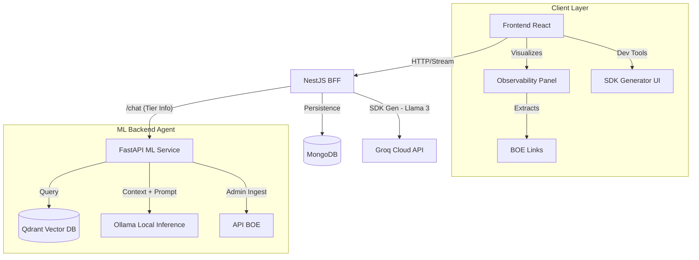

# Justiniano ⚖️

**Justiniano** is an Agentic Retrieval-Augmented Generation (RAG) system designed for the Spanish legal domain. It is not just a chatbot; it is a reasoning agent capable of reading, analyzing, and answering questions based on the Official State Gazette (BOE), featuring a modular architecture optimized for minimal operating costs ("Zero Cost Inference").

The project implements a microservices architecture with a Freemium model (Free/Pro Tier) that adjusts the Large Language Model (LLM) power according to the user's level.

---

## 🚀 Key Features

- **Modular Agentic RAG:** Clear separation between business orchestration (BFF) and intelligence (ML Service).
- **Reactive UI & Observability:** Modern React frontend featuring real-time streaming, markdown rendering, and a side panel for live metrics (TTFB Latency, Active Model).
- **Automatic Source Linking:** Client-side extraction of BOE citations using Regex, providing direct links to official documents.
- **Idempotent BOE Ingestion:** Robust pipeline to consume, parse (XML), and clean Spanish regulations, avoiding duplicates.
- **Advanced Semantic Search:** Vector engine based on Qdrant and BGE-M3 embeddings, with intelligent semantic chunking by articles and provisions.
- **AI SDK Generator:** Built-in tool to generate production-ready Python/Node.js clients using Llama 3 via Groq, based on the live OpenAPI spec.
- **Local & Hybrid Inference:** Native integration with Ollama to run models like Llama 3.1 and Gemma 2/Mistral locally (CPU/GPU).
- **Tiered Architecture:**
  - **Free Tier:** Fast responses using lightweight models (e.g., Llama 3.1 8B).
  - **Pro Tier:** Deep reasoning and agentic capabilities using larger models.
- **Persistent History:** Session and conversation context management via MongoDB.

---

## 🛠️ Tech Stack

### Frontend (Client)
- **Framework:** React 18 + Vite.
- **Language:** TypeScript.
- **Styling:** Tailwind CSS + Lucide React.
- **Features:** Custom Hooks (`useChat`), Optimistic UI, Server-Sent Events (SSE) handling.

### Backend - BFF (Backend for Frontend)
- **Framework:** NestJS (Node.js/TypeScript).
- **Responsibility:** Authentication, history management (Mongo), rate limiting, orchestration to ML.
- **Database:** MongoDB (Chat persistence).
- **AI SDK Gen:** Groq API (Llama 3) for on-the-fly client generation.

### Backend - ML (Machine Learning Service)
- **Framework:** FastAPI (Python).
- **Responsibility:** Data ingestion, RAG (Retrieval), Embedding generation, LLM connection.
- **Vector DB:** Qdrant (Dockerized).
- **LLM Engine:** Ollama (Local inference).
- **Tools:** `SentenceTransformers`, `BeautifulSoup4`, `Httpx`.

### Infrastructure & DevOps
- **Containerization:** Docker & Docker Compose.
- **Data Versioning:** DVC (Data Version Control) with Google Drive remote.
- **Testing:** Pytest (Backend ML) and Jest (BFF).

---

## 🏗️ System Architecture



---

## ⚡ Quick Start Guide

### Prerequisites
- Docker & Docker Compose installed.
- Node.js (v18+) installed.
- Ollama installed locally and running.
- **LLM Models:** You must download the models used by the service:
  ```bash
  ollama pull llama3.1:8b
  ollama pull gemma2
  ```

### 1. Environment Variables Configuration
Copy the example file and configure your credentials (especially for MongoDB and Admin Key):
```bash
cp .env.example .env
```
Ensure you define `ML_ADMIN_API_KEY`, the `MONGO` credentials, and `GROQ_API_KEY`/`GROQ_MODEL` for the SDK generator.

### 2. Launch Backend Infrastructure
The project uses Docker Compose to orchestrate the backend services and databases:
```bash
docker-compose up --build
```
This will launch:
- `backend-bff`: http://localhost:3000
- `backend-ml`: http://localhost:8001
- `qdrant-db`: http://localhost:6333
- `mongo-db`: port 27017

### 3. Launch Frontend (Local Development)
To enable Hot Module Replacement (HMR) and a better dev experience, run the frontend locally:
```bash
cd frontend
npm install
npm run dev
```
Access the UI at: http://localhost:5173

### 4. API Documentation & SDK Generation
Once the backend is running, you can access the interactive API documentation (Swagger UI) at:
- http://localhost:3000/api

To generate a client SDK for your preferred language (Python or Node.js):
1. Navigate to the "Developers" section in the Frontend (http://localhost:5173/developers).
2. Select your language.
3. Click "Generate Client SDK".
The system will use the live OpenAPI spec and Llama 3 to build a custom client library for you.

---

## 🗺️ Roadmap and Project Status

The project follows a modular evolutionary strategy.

- [x] **Phase 0: Technical Foundation**
  - Monorepo, Docker Compose, BFF (NestJS), and ML (FastAPI) connected.
- [x] **Phase 1: Data Ingestion (BOE)**
  - Robust ETL pipeline, legal-specific XML parser, idempotency control.
- [x] **Phase 1.5: Vector Engine (RAG)**
  - Semantic chunking (by articles), massive embedding generation (BGE-M3) offline (Colab), loading into Qdrant.
- [x] **Phase 3: Local Inference & Streaming**
  - Integration with Ollama, model selection logic (Free vs Pro), SSE streaming response.
- [x] **Phase 5: Frontend & Persistence (Completed)**
  - MongoDB integration in BFF.
  - Full React UI: Chat interface, Markdown rendering, and "Imperial" branding.
  - Observability Panel: Real-time latency tracking and source extraction.
- [ ] **Phase 2: Fine-Tuning (Postponed)**
  - Model adaptation (SFT/QLoRA) with specific legal dataset.
- [ ] **Phase 4: Editor Agent (Future)**
  - Capabilities for writing and editing PDFs through tool use.

---

## 📂 Project Structure

```text
.
├── backend-bff/          # NestJS: API Gateway and Business Logic
│   ├── src/chat/         # Chat Module and communication with ML
│   ├── src/conversations/# Persistence module in MongoDB
│   └── src/developers/   # AI SDK Generator (Groq integration)
├── backend-ml/           # FastAPI: RAG Brain and Ingestion
│   ├── boe_ingestion/    # ETL for the Official State Gazette
│   ├── data_processing/  # Chunking and vector loading scripts
│   ├── rag_agent/        # RAG Logic, Service, and Router
│   └── notebooks/        # Jupyter Notebooks for offline tasks (Colab)
├── frontend/             # React + Vite: User Interface
│   ├── src/components/   # UI Components (ChatInterface, MessageBubble, Panel)
│   ├── src/hooks/        # Custom Logic (useChat)
│   └── src/types/        # TypeScript Definitions
├── docker-compose.yml    # Container orchestration
└── README.md             # Project documentation
```

## 📝 License
Developed with ❤️ and lots of coffee in Valladolid, Spain.
